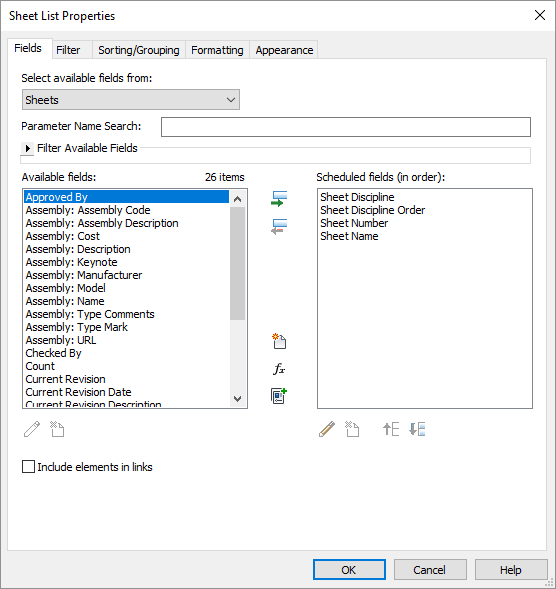
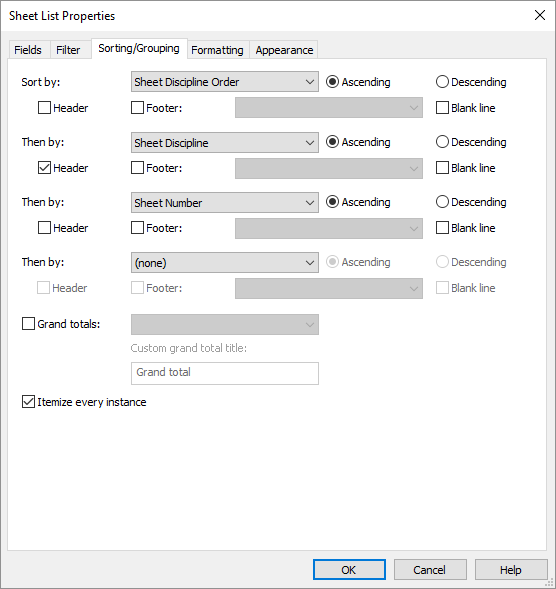
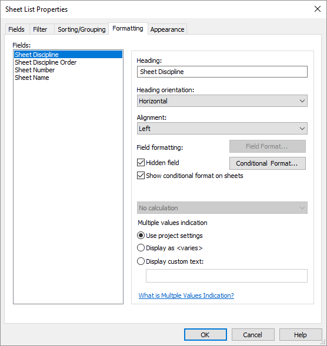

# Sheet Disciplines Add-in

The sheets in a set of construction documents are typically grouped by their discipline and those groups are sorted roughly in the order in which the disciplines become involved during construction. Civil sheets come before architectural sheets, for example, and plumbing sheets precede electrical ones. Unfortunately, Revit does not provide an out-of-the-box mechanism to ensure that sheets are properly grouped and sorted in a sheet index. The Sheet Disciplines Add-in provides and manages two parameters to help with that task:

- The *Sheet Discipline* parameter contains the name of the discipline the sheet belongs to.
- The *Sheet Discipline Order* parameter contains a number that can be used to sort the disciplines in the correct order.

Both parameters are assigned automatically based on the alphabetic characters at the beginning of the sheet number. By default, sheets whose numbers begin with "A" (i.e. A-101) are assigned to the Architectural discipline. Sheet numbers beginning with "C" are categorized under Civil, "E" under Electrical, and so on. The mappings between sheet number prefixes and discipline names are fully configurable, as are the order of the disciplines.

## Setting Up a Sheet List

To take advantage of the Sheet Disciplines Add-in, add the *Sheet Discipline* and *Sheet Discipline Order* parameters to the list of scheduled fields in your sheet list.

Next, change the sorting rules for the sheet list so that it is sorted first by *Sheet Discipline Order* and then by *Sheet Discipline*. Check the "Header" option for *Sheet Discipline* so that the name of each discipline is displayed above the sheets in that group.

Finally, make the *Sheet Discipline* and *Sheet Discipline Order* fields hidden by checking the "Hidden field" option for each field under the Formatting tab.

## Configuring Sheet Disciplines

To configure the list of disciplines for a project, go to the Add-Ins tab in the ribbon and click the Edit Disciplines button in the Sheet Disciplines group.

- To add a new discipline, type into the blank row at the bottom of the list.
- To delete a discipline, select its row and press the Delete key.
- To change the name or prefix of a discipline, double-click in the cell you which to edit.
- To change the order of disciplines, drag their rows up and down in the list.

## Compatibility

At present, this add-in only works with Revit 2022. Support for later versions of Revit is planned.
